```mermaid
erDiagram
  PRODUCTS ||--o{ PRODUCT_PROPERTIES : "properties"
  PROPERTY_DEFINITIONS ||--o{ PRODUCT_PROPERTIES : "defines"
  PRODUCTS ||--o{ SEO_METADATA : "seo (polymorphic)"
  USERS ||--o{ AUDIT_LOGS : "actor"
  ENTITY_REGISTRY ||--o{ AUDIT_LOGS : "guards entity_type"
  USERS ||--o{ COMPANY_MEMBERS : "memberships"
  CONTACTS ||--o{ ENQUIRIES : "enquiries"
  PRODUCTS ||--o{ PRODUCT_PACKINGS : "packs"
  PRODUCTS ||--o{ PRODUCT_SYNONYMS : "aliases"
  PRODUCTS ||--o{ PRODUCT_CAS_NUMBERS : "CAS"
  PRODUCTS ||--o{ PRODUCT_MOLECULAR_DATA : "formula"
  PRODUCTS ||--o{ PRODUCT_REVISIONS : "revisions"
  PRODUCTS ||--o{ PRODUCT_SHELF_LIFE : "shelf life"
  PRODUCTS ||--o{ PRODUCT_IMAGES : "images"
  PRODUCTS ||--o{ DOCUMENTS : "docs"
  PRODUCTS ||--o{ PRODUCT_SOURCE_URLS : "sources"
  PRODUCTS }o--o{ HS_CODES : "tariff codes"
  PRODUCTS }o--o{ CATEGORIES : "product categories"
  PRODUCTS ||--o{ PRODUCT_SEARCH_TERMS : "search"
  USERS ||--|| PROFILES : "1:1"
  USERS }o--o{ COMPANIES : "memberships"
  USERS }o--o{ ROLES : "grants"
  ROLES }o--o{ PERMISSIONS : "grants"
  USERS ||--o{ SAVED_FAVOURITES : "favourites"
  PRODUCTS ||--o{ SAVED_FAVOURITES : "favourites"
  USERS ||--o{ QUOTE_REQUESTS : "quotes"
  QUOTE_REQUESTS ||--o{ QUOTE_REQUEST_ITEMS : "items"
  COMPANIES ||--o{ CONTACTS : "people"
  BLOG_POSTS }o--o{ BLOG_CATEGORIES : "post cats"
  BLOG_POSTS }o--o{ BLOG_TAGS : "post tags"
  BLOG_POSTS }o--o{ PRODUCTS : "related"
```

# DR-Chem — Database Architecture

> Status: **Design document — no SQL migrations have been created yet.**
> Scope: PostgreSQL architecture for the entire planned DR-Chem platform
> (catalogue, categorization, search, users, quotes/leads, blog, admin/SEO).
> Target: a normalised relational PostgreSQL schema that runs on **Supabase
> PostgreSQL** today and on any **standard PostgreSQL** server (self-hosted or
> managed) without code or schema changes. No Supabase-specific features are
> assumed except where noted.

---

## 1. Purpose

This document defines the target data model for the DR-Chem platform. It is the
single source of truth for future migration work and for the importer that maps
the 2,908 canonical product JSON records into relational form.

Design goals:

1. **Normalised, avoid duplication** — one fact lives in one column; derived
   values (search vectors, denormalised lists) are clearly marked as derived.
2. **Unique constraints and foreign keys everywhere** — every relationship is
   enforced by the database, not just by the application.
3. **UUID primary keys** for all business entities (usable anywhere, portable,
   import-friendly via `gen_random_uuid()`).
4. **Searchable from day one** — PostgreSQL full-text search (`tsvector` +
   GIN) plus trigram/fuzzy search (`pg_trgm`) on every user-facing text field.
5. **Audit-friendly** — every table carries `created_at`/`updated_at`; core
   product changes are additionally versioned; all privileged mutations are
   recorded in `audit_logs`.
6. **Grows far beyond 2,908 products** — indexes, no unbounded `jsonb`, and
   partition-ready hot tables are designed in from the start.
7. **Portable** — standard types, standard constraints, CHECK-based enums
   (not native `CREATE TYPE` enums, which complicate migrations), and only the
   `pg_trgm` extension (bundled with PostgreSQL/Supabase) for fuzzy search.

---

## 2. Conventions

| Convention | Rule |
|---|---|
| Primary keys | `uuid` default `gen_random_uuid()` (built-in since PG 13) |
| Foreign keys | `uuid`, indexed, named `fk_<table>_<target>` |
| Timestamps | `timestamptz` (`created_at`, `updated_at`), default `now()` on all tables |
| Status/states | `text` + `CHECK (... IN (...))` — portable, easy to evolve |
| Currency | ISO `char(3)` code; amounts `numeric(12,4)` |
| Soft delete | none — physical delete plus audit trail; rows instead move to `archived` status |
| Text lookup | `citext` avoided for portability; case-insensitive handled via functional unique indexes (`lower(...)`) |
| Naming | snake_case, plural table names |

**Extension used:** `extensions pg_trgm` (for fuzzy search). It is standard
PostgreSQL and available on Supabase.

---

## 3. Entity overview (module map)

```
 auth/identity        users, profiles, roles, permissions, role_permissions, user_roles
 organisations        companies, company_members, countries
 catalogue            products, product_properties, property_definitions,
                      product_packings, product_synonyms, product_cas_numbers,
                      product_molecular_data, product_source_urls, documents,
                      product_images, product_revisions, product_shelf_life
 categorization       categories, product_categories, product_hs_codes, hs_codes
 search               product_search_terms
 users                saved_favourites, audit_logs
 infrastructure       entity_registry (polymorphic-FK guard, §7.8)
 business             quote_requests, quote_request_items, leads, contacts, enquiries
 blog                 blog_categories, blog_posts, blog_post_categories, blog_tags,
                      blog_post_tags, blog_post_products
 seo                  seo_metadata
```

The high-level relationship map is described in §15 after the full catalogue.

**Total: 41 tables** — 9 identity/organisation (`users`, `profiles`, `roles`,
`permissions`, `role_permissions`, `user_roles`, `companies`,
`company_members`, `countries`), 12 catalogue, 4 categorization, 1 search
(`product_search_terms`), 2 user-features (`saved_favourites`, `audit_logs`),
1 infrastructure guard (`entity_registry`), 5 business, 6 blog, and
`seo_metadata`.

*(ER diagram rendered as comments to be portable; a Mermaid diagram is included at the end of the document.)*
---

## 4. Catalogue schema (core)

### 4.1 `products`

**Purpose:** the single canonical record for every catalogue item — the root
entity of the whole platform. All other catalogue tables hang off it.

| Column | Type | Null | Default | Notes |
|---|---|---|---|---|
| `id` | uuid | no | `gen_random_uuid()` | PK |
| `legacy_ref` | text | yes | — | Source-catalogue reference (e.g. `CD-00123`); `UNIQUE`, the join key for idempotent re-import of the 2,908 JSON records |
| `name` | text | no | — | Display name |
| `slug` | text | yes | — | URL slug; **partial** `UNIQUE (slug) WHERE slug IS NOT NULL`; collision-safe rule in §4.1.1 |
| `article_number` | text | yes | — | Vendor article number; `UNIQUE`, trigram-indexed for partial matches |
| `summary` | text | yes | — | Short marketing blurb |
| `description` | text | yes | — | Long HTML/Markdown description |
| `status` | text | no | `'draft'` | `CHECK (status IN ('draft','active','inactive','archived'))` |
| `is_featured` | boolean | no | `false` | Editorial flag |
| `revision_number` | integer | no | `1` | Optimistic-concurrency token; incremented in the same transaction as every product-fact change (§4.1.2) |
| `published_at` | timestamptz | yes | — | Set when first published |
| `updated_by` | uuid | yes | — | FK → `users.id` (audit) |
| `created_at` / `updated_at` | timestamptz | no | `now()` | — |

**Constraints:** PK; `UNIQUE (legacy_ref)`; partial `UNIQUE (slug) WHERE slug IS NOT NULL`;
`UNIQUE (article_number)`; `CHECK (revision_number > 0)`.

**Key indexes:** B-tree on `status`, `published_at`, `updated_at`; GIN trigram on
`name`; GIN trigram on `article_number`. (Full search lives in §7.)

**Nullability rationale:** `description`/`summary` are nullable because the
source catalogue does not provide them for every record and they can be added
later without blocking import; `article_number` is nullable because some
products genuinely lack one; `published_at` is null until first publication;
`slug` is nullable *only during import* — see the collision-safe strategy
below (it must never be null on a published product).

### 4.1.1 Collision-safe slug strategy

`products.slug` is the public, unique URL key and is the one column whose
absolute uniqueness cannot be guaranteed from the source data alone — a
2,908-record chemistry catalogue contains many near-identical names ("Ethanol
99.5%", "Ethanol absolute", "Ethanol anhydrous", "Ethanol <200 proof"). A
plain `UNIQUE (slug)` with eager `NOT NULL` would make the very first import
fail on a duplicate name.

**Rule (deterministic, applied by the importer):**

1. `base := url_slugify(name)` — lowercase, strip diacritics, collapse
   non-alphanumerics to `-`, trim leading/trailing `-`.
2. If `base` is empty, `base := 'product'`.
3. If `base` is already taken (by another row in this batch or already in the
   database), append a suffix derived from the **stable** `legacy_ref`:
   `base || '-' || substring(lower(legacy_ref), 1, 6)`, retrying with `-1`,
   `-2`, … only if that suffixed value is somehow also taken.
4. Because the suffix derives from the immutable `legacy_ref`, re-imports are
   **idempotent** — the same source record always produces the same slug, so
   rerunning the batch touches nothing and cannot deadlock on the unique key.

**Schema consequence:** the unique constraint on `slug` is **partial**
(`UNIQUE (slug) WHERE slug IS NOT NULL`), so the importer can insert products
first and backfill slugs in a later pass without violating the constraint;
published products always carry a slug. The importer validates slug
uniqueness before it touches any FTS rows.

### 4.1.2 Concurrency: `revision_number`

`revision_number` is the optimistic-concurrency token for the whole product
aggregate. Every write that changes any product fact (name, description,
properties, packings, CAS, …) must:

1. read the current `revision_number`;
2. apply the update with `WHERE id = :id AND revision_number = :expected`;
3. **in the same transaction**, increment `revision_number` and add a matching
   `product_revisions` row (human-readable history) and an `audit_logs` row
   (change snapshot);
4. if zero rows were updated (the expected revision is stale), abort and
   return a conflict to the client to retry on fresh data.

This prevents "last writer wins" data loss when an import batch and an admin
edit collide. `updated_at` is informational only — it is *not* a concurrency
token.

### 4.2 `product_properties`

**Purpose:** consolidated fact table for every named property of a product —
commercial/grade specifications (purity, grade, appearance, assay method,
compliance) *and* physical/chemical properties (density, melting point,
boiling point, flash point, refractive index). The two previously separate
tables were merged because they store the same kind of fact — a named
key-value property — and differ only in *which* property they hold. The
"spec vs physical" distinction is now a first-class attribute of the property
definition (§4.3), not a storage split. This halves the importer's write path,
gives a single unique anchor per `(product_id, property_definition_id)`, and
lets numeric filtering ("all products with density …") scan one index instead
of two.

| Column | Type | Null | Default | Notes |
|---|---|---|---|---|
| `id` | uuid | no | `gen_random_uuid()` | PK |
| `product_id` | uuid | no | — | FK → `products.id` (CASCADE) |
| `property_definition_id` | uuid | no | — | FK → `property_definitions.id` (RESTRICT) |
| `value_text` | text | yes | — | Non-numeric value (e.g. `>= 98 %`, "insoluble in water", "white powder") |
| `value_min` / `value_max` | numeric(16,6) | yes | — | Numeric range (points use both = same value); only for definitions with `is_numeric` |
| `unit` | text | yes | — | Display unit, e.g. `g/cm³`, `°C`; null inherits the definition's `unit_default` |
| `sort_order` | smallint | no | `0` | Rendering order; overrides the definition default when set |

**Constraints:** `UNIQUE (product_id, property_definition_id)` — one value per
defined property per product (no duplicated property rows); `CHECK (value_text
IS NOT NULL OR value_min IS NOT NULL)` — every property must carry *some*
value.

**Nullability:** `value_text` vs `value_min`/`value_max`/`unit` are mutually
alternative because the source data mixes strings and numeric ranges; exactly
one value form is populated per row. `unit` may be null to inherit the
definition's default; `sort_order` is optional and defaults to the definition's
ordering.

**Indexes:** B-tree `(product_id, property_definition_id)`; B-tree
`(property_definition_id)` for across-catalogue filtering; trigram GIN on
`value_text` (spec-value search, §6.4).

### 4.3 `property_definitions` (property vocabulary)

**Purpose:** the shared vocabulary behind every product property. Each row
defines a property *code* exactly once (`density`, `purity`, `grade`,
`boiling_point`, …), its human label, expected unit, whether it is numeric,
and which domain it belongs to. This removes repeated property-name strings
across ~22k property rows, standardises units and numeric semantics in one
place, and gives the admin UI a fixed, editable list. It also replaces the old
"spec vs physical" split with a first-class discriminator.

| Column | Type | Null | Default | Notes |
|---|---|---|---|---|
| `id` | uuid | no | `gen_random_uuid()` | PK |
| `code` | text | no | — | Stable machine key, e.g. `density`, `purity`; `UNIQUE` |
| `property_type` | text | no | — | `CHECK (property_type IN ('spec','physical'))` |
| `label` | text | no | — | Display label, e.g. "Density" |
| `unit_default` | text | yes | — | e.g. `g/cm³`, `°C`; inherited when `product_properties.unit` is null |
| `is_numeric` | boolean | no | `false` | Whether `value_min`/`value_max` are expected |
| `sort_order` | smallint | no | `0` | Suggested render order |
| `created_at` / `updated_at` | timestamptz | no | `now()` | — |

**Constraints:** `UNIQUE (code)`; `CHECK (property_type IN ('spec','physical'))`.

**Nullability:** `unit_default` — unit-less properties (e.g. grade) leave it
null; all other columns are required.

**Relationship to the old tables:** `product_specifications.name` becomes a row
in `property_definitions` with `property_type='spec'`; its `value` maps to
`product_properties.value_text` (or to `value_min`/`value_max` when
parseable). `product_physical_properties.property` becomes a definition with
`property_type='physical'`; its `value_text`/`value_min`/`value_max` map
directly. A property that appears in both flows keeps **one** definition row —
`property_type` is a report/filtering hint, not a storage split.

**Seed data:** the importer seeds `property_definitions` from the known
property keys in the canonical JSON before inserting `product_properties`,
creating any previously unseen code on the fly (upsert by `code`).

### 4.4 `product_packings`

**Purpose:** the pack sizes a product is sold in (e.g. 25 g / 100 g / 1 kg /
5 kg / 25 kg), each with its own SKU and optional price.

| Column | Type | Null | Default | Notes |
|---|---|---|---|---|
| `id` | uuid | no | `gen_random_uuid()` | PK |
| `product_id` | uuid | no | — | FK → `products.id` (CASCADE) |
| `code` | text | no | — | Packing SKU; `UNIQUE (product_id, code)` |
| `title` | text | yes | — | e.g. "Bottle 100 g" |
| `description` | text | yes | — | Packing notes |
| `size_value` | numeric(12,4) | yes | — | e.g. `100` |
| `size_unit` | text | yes | — | e.g. `g`, `kg`, `L`, `ml` |
| `price` | numeric(12,4) | yes | — | Unit price for this pack |
| `currency` | char(3) | yes | — | ISO code, e.g. `EUR` |
| `is_active` | boolean | no | `true` | — |

**Constraints:** `UNIQUE (product_id, code)`.

**Nullability:** `title`/`description`/`size`/`price`/`currency` — a packing may
exist as an internal SKU before pricing is finalised; price must not be assumed.

### 4.5 `documents`

**Purpose:** metadata for files attached to products (SDS, TDS, CoA, catalogues).
The binary content lives in object storage (§10); the database stores the key
and metadata.

| Column | Type | Null | Default | Notes |
|---|---|---|---|---|
| `id` | uuid | no | `gen_random_uuid()` | PK |
| `product_id` | uuid | yes | — | FK → `products.id` (nullable: global documents) |
| `document_type` | text | no | — | `CHECK (document_type IN ('sds','tds','coa','catalogue','regulatory','other'))` |
| `title` | text | no | — | — |
| `description` | text | yes | — | — |
| `storage_key` | text | no | — | Object-storage key of the file |
| `original_filename` | text | yes | — | — |
| `mime_type` | text | yes | — | — |
| `file_size_bytes` | bigint | yes | — | — |
| `version` | smallint | no | `1` | Incremented on re-upload |
| `is_active` | boolean | no | `true` | — |
| `published_at` | timestamptz | yes | — | — |

**Key indexes:** `(product_id)`, `(document_type)`.

**Nullability:** `product_id` nullable so future global/company documents can
reuse the table; filename/mime/size are metadata that may be unknown for legacy
records.

### 4.6 `product_images`

**Purpose:** image gallery for a product. Pixels live in object storage; the DB
keeps the storage key, ordering, and primary flag.

| Column | Type | Null | Default | Notes |
|---|---|---|---|---|
| `id` | uuid | no | `gen_random_uuid()` | PK |
| `product_id` | uuid | no | — | FK → `products.id` (CASCADE) |
| `storage_key` | text | no | — | Object-storage key; `UNIQUE (product_id, storage_key)` |
| `url` | text | yes | — | Ready-to-serve URL (CDN), cache-only |
| `alt_text` | text | yes | — | Accessibility/SEO |
| `caption` | text | yes | — | Display caption |
| `sort_order` | int | no | `0` | Gallery order |
| `is_primary` | boolean | no | `false` | Thumbnail flag |

**Indexes:** `(product_id, sort_order)`; **partial unique index**
`UNIQUE (product_id) WHERE is_primary` — at most one primary image per product.

**Nullability:** `url`, `alt_text`, `caption` — `url` may be generated on
demand; alt/caption are editorial and optional.

### 4.7 `product_synonyms`

**Purpose:** every alternate name/alias for a product, used for search matching
and auto-complete.

| Column | Type | Null | Default | Notes |
|---|---|---|---|---|
| `id` | uuid | no | `gen_random_uuid()` | PK |
| `product_id` | uuid | no | — | FK → `products.id` (CASCADE) |
| `synonym` | text | no | — | e.g. "ethanol" ↔ "ethyl alcohol" |
| `language` | char(2) | no | `'en'` | ISO 639-1 |
| `is_common` | boolean | no | `true` | Boost weight in search |
| `sort_order` | smallint | no | `0` | — |

**Constraints:** functional unique index `UNIQUE (product_id, lower(synonym))`.

**Indexes:** trigram GIN on `synonym` (fuzzy match); B-tree on `synonym`.

**Nullability:** none — a synonym without text is meaningless.

### 4.8 `product_cas_numbers`

**Purpose:** CAS Registry Numbers for a product. One is primary; alternates are
allowed for multi-CAS materials. A CAS is validated for format, not checksum
(no official checksum algorithm is publicly authoritative).

| Column | Type | Null | Default | Notes |
|---|---|---|---|---|
| `id` | uuid | no | `gen_random_uuid()` | PK |
| `product_id` | uuid | no | — | FK → `products.id` (CASCADE) |
| `cas_number` | text | no | — | `CHECK (cas_number ~ '^[0-9]{2,7}-[0-9]{2}-[0-9]$')` |
| `is_primary` | boolean | no | `false` | — |
| `note` | text | yes | — | e.g. "discontinued number" |

**Constraints:** `UNIQUE (product_id, cas_number)`; partial unique
`UNIQUE (product_id) WHERE is_primary`.

**Indexes:** B-tree on `cas_number` (exact lookup, dedupe across products).

**Nullability:** `note` only.

### 4.9 `product_molecular_data`

**Purpose:** molecular formula + molecular weight — searchable chemical
identity beyond names.

| Column | Type | Null | Default | Notes |
|---|---|---|---|---|
| `id` | uuid | no | `gen_random_uuid()` | PK |
| `product_id` | uuid | no | — | FK → `products.id` (CASCADE) |
| `formula` | text | no | — | e.g. `C2H5OH`; `UNIQUE (product_id, formula)` |
| `molecular_weight` | numeric(16,6) | yes | — | g/mol |
| `is_primary` | boolean | no | `true` | — |

**Indexes:** trigram GIN on `formula`.

**Nullability:** `molecular_weight` — not all entries ship with a weight; the
formula is always present for imported products.

### 4.10 `hs_codes` and `product_hs_codes`

**Purpose:** HS (Harmonized System) tariff codes are a shared, finite
vocabulary — normalised once into `hs_codes` and linked via a junction, so the
same code is reused by many products and stored once, never duplicated per
product row.

`hs_codes` — `id`, `code` (text, `UNIQUE`), `description` (nullable).

`product_hs_codes` — `id`, `product_id` FK, `hs_code_id` FK,
`is_primary` boolean, `sort_order`.

**Constraints:** `UNIQUE (product_id, hs_code_id)`; partial unique
`UNIQUE (product_id) WHERE is_primary`.

**Retained as a junction — why not `products.hs_code_id`?** The canonical JSON
ships either a single `hs_code` *or* a `customs_codes[]` array, and the source
evidence available to this project does **not** establish a firm
one-HS-code-per-product invariant across all 2,908 records. Until the source
catalogue is verified as single-valued, a normalized junction is the safe
choice: it stores every tariff code once, supports both cardinalities without
a migration, and costs one row for the common single-code case (marked via
`is_primary`). If the importer's data-quality report later shows 100%
single-HS, a future migration can collapse this to a nullable
`products.hs_code_id` cheaply — the reverse (junction → column) is *not* safe
if multi-valued records exist, so the junction is the conservative and
reversible design.

### 4.11 `product_shelf_life`

**Purpose:** shelf-life / storage conditions for a product (defaults; a
packing-level override can be added later without a schema change).

| Column | Type | Null | Default | Notes |
|---|---|---|---|---|
| `id` | uuid | no | `gen_random_uuid()` | PK |
| `product_id` | uuid | no | — | FK → `products.id` (CASCADE); `UNIQUE` (one shelf-life row per product) |
| `period_value` | numeric(5,1) | yes | — | e.g. `36` |
| `period_unit` | text | yes | — | `CHECK (period_unit IN ('hours','days','months','years'))` |
| `storage_conditions` | text | yes | — | Free text, e.g. "store in a cool dry place" |
| `notes` | text | yes | — | — |

**Nullability:** everything except `product_id` — many legacy records state no
expiry; the row then records *"no stated shelf life"* only in `notes`.

### 4.12 `product_source_urls`

**Purpose:** provenance of catalogue rows — where each record was harvested
from. Many-to-many because a product can appear on several pages.

| Column | Type | Null | Default | Notes |
|---|---|---|---|---|
| `id` | uuid | no | `gen_random_uuid()` | PK |
| `product_id` | uuid | no | — | FK → `products.id` (CASCADE) |
| `url` | text | no | — | Fully-qualified URL; `UNIQUE (product_id, url)` |
| `source_type` | text | no | `'other'` | `CHECK (source_type IN ('catalogue','datasheet','supplier','other'))` |
| `is_primary` | boolean | no | `false` | Canonical source page |
| `note` | text | yes | — | — |

**Indexes:** B-tree on `url` (global duplicate check).

### 4.13 `product_revisions`

**Purpose:** revision history per product, satisfying the "revision dates"
requirement and the audit-friendly principle.

| Column | Type | Null | Default | Notes |
|---|---|---|---|---|
| `id` | uuid | no | `gen_random_uuid()` | PK |
| `product_id` | uuid | no | — | FK → `products.id` (CASCADE) |
| `revision_date` | date | no | — | When the source data was last revised |
| `summary` | text | yes | — | What changed |
| `changed_by_user_id` | uuid | yes | — | FK → `users.id` (null = import/system) |

**Constraints:** `UNIQUE (product_id, revision_date)`.

**Nullability:** `summary`/`changed_by_user_id` — automated imports leave no
actor user; the date itself is the primary fact.

**Indexes:** `(product_id, revision_date DESC)`.

### 4.14 Reservation for `product_notes`

Photographs, documentation, packaging, shelf life and sources are all
normalised above. No free-form monolith table is added now; future ad-hoc
product notes can be introduced as a thin `product_notes` table without
touching imports.

---

## 5. Categorization

### 5.1 `categories` (self-referencing hierarchy)

**Purpose:** a tree of categories and subcategories (arbitrary depth). A
category may describe itself, carry display settings, and reference SEO
metadata (see §12.3).

| Column | Type | Null | Default | Notes |
|---|---|---|---|---|
| `id` | uuid | no | `gen_random_uuid()` | PK |
| `parent_id` | uuid | yes | — | FK → `categories.id` (self); NULL = root category |
| `name` | text | no | — | Display name |
| `slug` | text | no | — | `UNIQUE` — URL path segment |
| `description` | text | yes | — | Long description for listing pages |
| `sort_order` | smallint | no | `0` | Order among siblings |
| `is_active` | boolean | no | `true` | Editorial visibility |
| `is_visible_in_menu` | boolean | no | `true` | Navigation visibility |
| `created_at` / `updated_at` | timestamptz | no | `now()` | — |

**Constraints:** `UNIQUE (slug)`; `CHECK (parent_id IS NULL OR parent_id <> id)`
(no self-parenting).

**Indexes:** B-tree on `parent_id` (tree traversal via recursive CTE).

**Nullability:** `parent_id` — NULL explicitly marks a root node (there is no
"virtual root"); `description` optional.

**Hierarchy notes:** the adjacency list (self-FK) is portable and simple; deep
subtree queries use a recursive CTE, which PostgreSQL handles efficiently at
this scale. If a future need for materialised paths arises, the `ltree`
extension can be layered on without changing this table's shape. Subcategories
are *not* a separate table — they are categories whose `parent_id` is set.

**Integrity rules (enforced by the importer and the admin API, which own all
writes to `categories.parent_id`):**

- **Cycle prevention.** `CHECK (parent_id <> id)` forbids self-parenting, but a
  longer cycle (A→B→A) cannot be expressed in a portable declarative
  constraint. The write path therefore validates the tree with a bounded
  recursive walk (or a `WITH RECURSIVE` existence check) before every
  `parent_id` insert or update, and rejects any change that would create a
  cycle. The batch importer builds the tree top-down from the source path data
  and validates it the same way, so no cycle can enter through bulk import.
- **Parent/child double-link prevention.** A product may appear in a category
  *and* in that category's descendant via `product_categories`. If both links
  are kept, ancestor category pages double-list the product and search matches
  it twice. The importer applies this rule when syncing `product_categories`:
  **if a product is linked to a descendant of a category it is already linked
  to, the redundant ancestor link is suppressed**, keeping exactly the deepest
  canonical edges. This is a data-shape rule owned by the importer (it cannot
  be a relational constraint), and it is documented here so migrations never
  re-enable the double-linking through triggers.

### 5.2 `product_categories` (many-to-many)

**Purpose:** lets a product belong to **multiple** categories simultaneously
(e.g. same chemical under "Solvents", "Synthesis Reagents" and "Cleaning
Agents") while keeping exactly one primary for breadcrumbs/URLs.

| Column | Type | Null | Default | Notes |
|---|---|---|---|---|
| `id` | uuid | no | `gen_random_uuid()` | PK |
| `product_id` | uuid | no | — | FK → `products.id` (CASCADE) |
| `category_id` | uuid | no | — | FK → `categories.id` (CASCADE) |
| `is_primary` | boolean | no | `false` | Canonical category |
| `sort_order` | smallint | no | `0` | Order within the "also in" list |

**Constraints:** `UNIQUE (product_id, category_id)`;
**partial unique** `UNIQUE (product_id) WHERE is_primary`.

**Indexes:** `(category_id, product_id)` (category page paging), `(product_id)`.

**Nullability:** none — a junction row is meaningless without both ends.

### 5.3 Category SEO

Each category's SEO values (meta title, meta description, canonical URL…) live
in the shared `seo_metadata` table (§12.3) keyed by
`(entity_type = 'category', entity_id)`. Category **descriptions** are columns
on `categories` (§5.1) because they are content, not metadata.

---

## 6. Search architecture

### 6.1 Strategy

Three complementary mechanisms, all standard PostgreSQL:

1. **Trigram fuzzy search** (`pg_trgm`) for name/article/synonym — tolerant of
   typos and partial terms.
2. **Full-text search** (`tsvector` + GIN) for ranked relevance across all
   searchable text fields.
3. **Exact B-tree lookups** for CAS numbers, slugs and article numbers.

Rather than scattering `tsvector` columns across a dozen tables, all searchable
terms are normalised into one **derived** table, `product_search_terms`, populated
by the importer. This keeps the source tables purely relational and gives the
search index a single, well-understood home.

### 6.2 `product_search_terms`

| Column | Type | Null | Default | Notes |
|---|---|---|---|---|
| `id` | uuid | no | `gen_random_uuid()` | PK |
| `product_id` | uuid | no | — | FK → `products.id` (CASCADE) |
| `term` | text | no | — | The searchable text fragment |
| `source_type` | text | no | — | `CHECK (source_type IN ('name','article_number','cas','synonym','formula','category','spec','hs_code','other'))` |
| `weight` | numeric(3,2) | no | `1.00` | Relevance weight (1.0 name/cas, 0.9 article, 0.8 synonym/category, 0.7 spec-property/hs) |
| `language` | char(2) | no | `'en'` | For future multi-language stemming |
| `normalized_term` | text | no | — | Derived: unicode-folded, lower-cased, punctuation-stripped projection of `term`; powers diacritic/case-insensitive type-ahead |
| `ts_config` | regconfig | no | `'simple'` | Per-term FTS configuration (`simple` for chemistry; `english` for future natural-language terms) |

**Derived column:** `search_vector tsvector` `GENERATED ALWAYS AS
(to_tsvector(ts_config, term)) STORED` — `ts_config` defaults to `simple`,
which keeps chemical names and CAS strings intact (no aggressive stemming);
per-row `'english'` can be enabled later for natural-language terms (e.g.
future blog search) without a table change.

**Constraints:** `UNIQUE (product_id, source_type, lower(term))`.

**Indexes (the important ones):**

| Index | Type | Why |
|---|---|---|
| `(product_id)` | B-tree | join back to products |
| `GIN (search_vector)` | GIN `tsvector` | ranking `ts_rank` searches |
| `GIN (term gin_trgm_ops)` | GIN trigram | fuzzy / as-you-type matching |
| `GIN (normalized_term gin_trgm_ops)` | GIN trigram | diacritic/case-insensitive type-ahead |
| `(term)` | B-tree | exact prefix lookups |

**Nullability:** none — an index row without a term is noise; rows are deleted
when the source value disappears (kept in sync by the importer inside one
transaction).

### 6.3 Ranking

```
ts_rank(search_vector, query_tsv) * weight
```
Weights tune chemistry-specific importance: a CAS hit must beat a spec hit,
even though "12-345-6" would otherwise rank low. Category hits are included so
a search for "solvent" surfaces products *in* the Solvents category.

### 6.4 What is searched

- product `name`, `article_number` (from `products`)
- every `product_synonyms.synonym`
- every `product_cas_numbers.cas_number`
- `product_molecular_data.formula`
- category `name` (from `product_categories` → `categories`)
- `product_properties.value_text` — **excluded from primary FTS initially** (decision: noisy spec values like "≥ 98 %" would pollute ranking); may be added later as a config flag, numeric ranges remain indexed via their text projection
- `hs_codes.code`+`description` (via `product_hs_codes`)

### 6.5 Keyset (cursor) pagination

Ranked searches must **not** use `OFFSET` paging — at ~60k search rows with
fuzzy expansions, `OFFSET` degrades badly after the first pages. Every publicly
paginating query (catalogue listing, category page, search results) uses
**keyset pagination**:

- Order by a stable, total order — `(rank DESC, product.id DESC)` for search,
  `(product.id DESC)` for plain listings — and page by
  `WHERE (rank, id) < (:last_rank, :last_id)` (or `>`, depending on direction)
  for the next cursor.
- The tie-breaker is always the immutable `products.id` (uuid), so cursors
  remain stable across concurrent inserts and re-imports.
- Servers return an opaque `next_cursor`; clients never construct page
  numbers. This is portable SQL (no extensions) and index-friendly.

### 6.6 Fuzzy-search fallback ladder

User-facing search runs through a deterministic two-stage ladder so that
"ethnol" still surfaces "ethanol":

1. **Stage 1 — exact/ranked FTS:** run
   `ts_rank(search_vector, plainto_tsquery(ts_config, :q)) * weight` on
   `product_search_terms`. If results ≥ `FTS_FALLBACK_THRESHOLD`
   (app-configurable constant; **initial value: 5**), return them.
2. **Stage 2 — trigram fuzzy fallback:** otherwise run trigram similarity
   (`similarity(normalized_term, :q)` or `%`-wildcard `LIKE` on the
   B-tree prefix index) and re-rank by similarity × weight against the same
   `product_search_terms` table.
3. **Stage 3 — "no results" synonyms:** if still empty, surface other terms
   from `product_search_terms` that share a trigram with `:q` (the "did you
   mean" row), i.e. an exact-CAS/synonym cross-reference maintained by the
   importer, not a live thesaurus.

The threshold and weights are app-configurable constants (see the remaining
human-decision list in the project roadmap); the schema (trigram GIN on
`term` and `normalized_term`, B-tree prefix index) supports all three stages
with indexes already listed in §6.2/§13.

---

## 7. Identity, organisations, permissions

### 7.1 `users`

**Purpose:** application-level accounts. When hosted on Supabase, Supabase
Auth owns the credential (`auth.users`); the DR-Chem `users` row mirrors the
Supabase user UUID and carries the application state. When self-hosted later,
`password_hash` stores a bcrypt hash here — the application reads the same
`users` table either way, keeping the design provider-agnostic.

| Column | Type | Null | Default | Notes |
|---|---|---|---|---|
| `id` | uuid | no | `gen_random_uuid()` | PK; equals Supabase Auth `users.id` when hosted |
| `email` | text | no | — | `UNIQUE` on `lower(email)` (functional index) |
| `password_hash` | text | yes | — | NULL when Supabase Auth owns credentials |
| `display_name` | text | yes | — | — |
| `status` | text | no | `'active'` | `CHECK (status IN ('active','inactive','suspended'))` |
| `email_verified_at` | timestamptz | yes | — | NULL until verified |
| `last_login_at` | timestamptz | yes | — | — |
| `created_at` / `updated_at` | timestamptz | no | `now()` | — |

**Nullability rationale:** `password_hash` is null under Supabase Auth; the
account row exists before any login; `display_name` may be unset at signup;
verification/login timestamps are naturally upcoming events. Email and status
are never null because they are required for any account to function.

### 7.2 `profiles` — one-to-one extension of `users`

**Purpose:** optional public/editorial profile data. Kept 1:1 so `users` stays
lean and profile fields can evolve independently.

| Column | Type | Null | Default | Notes |
|---|---|---|---|---|
| `id` | uuid | no | — | PK **and** FK → `users.id` (1:1 enforced by the PK) |
| `avatar_storage_key` | text | yes | — | object-storage key |
| `phone` | text | yes | — | — |
| `job_title` | text | yes | — | — |
| `bio` | text | yes | — | — |
| `timezone` | text | yes | `'UTC'` | IANA name |
| `language` | char(2) | no | `'en'` | — |

**Nullability:** all profile fields optional; a freshly created profile may be
entirely empty apart from the key.

### 7.3 `companies`

**Purpose:** business customers / accounts for quote workflows.

| Column | Type | Null | Default | Notes |
|---|---|---|---|---|
| `id` | uuid | no | `gen_random_uuid()` | PK |
| `name` | text | no | — | Company name |
| `vat_number` | text | yes | — | `UNIQUE` where known |
| `website_url` | text | yes | — | — |
| `phone` | text | yes | — | — |
| `address_line1`…`address_line3` | text | yes | — | — |
| `city` / `region` / `postal_code` | text | yes | — | — |
| `country_iso2` | char(2) | yes | — | FK → `countries.iso2` |
| `is_verified` | boolean | no | `false` | KYC-ish flag for staff |
| `is_active` | boolean | no | `true` | — |

**Nullability:** address/tax/website are progressively completable; only `name`
is mandatory.

### 7.4 `countries`

`iso2` char(2) PK, `name` text NOT NULL, `phone_code` smallint NULL. Tiny
lookup used by `companies`/`quote_requests` — keeps addresses normalised
without free-text country strings.

### 7.5 `company_members`

**Purpose:** many-to-many `users ↔ companies` (a consultant may represent
several companies; a company may have many users).

| Column | Type | Null | Default | Notes |
|---|---|---|---|---|
| `id` | uuid | no | `gen_random_uuid()` | PK |
| `company_id` | uuid | no | — | FK → `companies.id` (CASCADE) |
| `user_id` | uuid | no | — | FK → `users.id` (CASCADE) |
| `role` | text | no | `'member'` | `CHECK (role IN ('owner','admin','member','billing'))` |
| `is_primary_company` | boolean | no | `false` | Default context on login |

**Constraints:** `UNIQUE (company_id, user_id)`; partial unique
`UNIQUE (user_id) WHERE is_primary_company`.

### 7.6 Roles & permissions (RBAC)

**Purpose:** fine-grained admin/staff/customer permissions in a fully
normalised form. Seed data defines `admin`, `staff`, `customer` roles; a
permission is a capability (e.g. `products.publish`, `quotes.manage`).
Roles ↔ permissions and users ↔ roles are many-to-many.

| Table | Columns (abridged) | Notes |
|---|---|---|
| `roles` | `id`, `code` (unique), `name`, `description`, `is_system`, timestamps | look-up; `is_system` protects seed rows |
| `permissions` | `id`, `code` (unique), `name`, `module`, `description` | e.g. `module='catalogue'` |
| `role_permissions` | `role_id`, `permission_id` | `UNIQUE (role_id, permission_id)` |
| `user_roles` | `user_id`, `role_id` | `UNIQUE (user_id, role_id)` |

**Indexes:** each junction has indexes on both foreign keys, plus the unique
pair. `roles.code` and `permissions.code` unique. "Admin" is therefore not a
flag on `users` but a role grant — adding a second admin is a row insert, and
auditing who granted what is a normal `audit_logs` entry.

### 7.7 `saved_favourites`

**Purpose:** "saved / favourite products" per user.

| Column | Type | Null | Default | Notes |
|---|---|---|---|---|
| `id` | uuid | no | `gen_random_uuid()` | PK |
| `user_id` | uuid | no | — | FK → `users.id` (CASCADE) |
| `product_id` | uuid | no | — | FK → `products.id` (CASCADE) |
| `note` | text | yes | — | User's own remark |
| `created_at` | timestamptz | no | `now()` | — |

**Constraints:** `UNIQUE (user_id, product_id)`. **Indexes:** `(user_id)`,
`(product_id)`.

### 7.8 `audit_logs`

**Purpose:** append-only record of privileged mutations — the backbone of the
admin/audit requirement. Reference integrity is deliberately loose
(`entity_type` + `entity_id`, no hard FK) so one log table covers every entity.

| Column | Type | Null | Default | Notes |
|---|---|---|---|---|
| `id` | bigserial | no | — | PK (append-only log; bigint order is natural) |
| `actor_user_id` | uuid | yes | — | FK → `users.id`; NULL = system/import |
| `action` | text | no | — | e.g. `update`, `publish`, `delete` |
| `entity_type` | text | no | — | table the entity lives in |
| `entity_id` | uuid | no | — | the row's PK |
| `changes` | jsonb | no | `'{}'` | before/after snapshot of changed columns |
| `created_at` | timestamptz | no | `now()` | — |

**Indexes:** `(entity_type, entity_id)`, `(actor_user_id)`, `(created_at)`.

**Nullability:** `actor_user_id` — import pipes and system jobs have no acting
user; everything else is required.

**Referential integrity (trigger-based):** because `entity_type` + `entity_id`
is polymorphic, a single hard FK is impossible. Integrity is restored with a
**shared referential guard**, the same design used for `seo_metadata` (§12.3):

- a small seeded table `entity_registry(entity_type text PK, table_name text
  NOT NULL)` lists exactly the entity types allowed — the same list the
  `audit_logs.entity_type` CHECK permits;
- a `BEFORE INSERT OR UPDATE` trigger
  (`trg_audit_logs_referential_integrity`) looks up `table_name` from
  `entity_registry` by `NEW.entity_type`, then performs
  `EXISTS (SELECT 1 FROM <table_name> WHERE id = NEW.entity_id)` and raises an
  exception when the row is missing. The dynamic table name comes **only**
  from the seeded registry (never from user input), so there is no injection
  surface;
- the guard is consistent with this design's disposal model: entities are
  soft-archived rather than hard-deleted, so audit rows always reference a
  live row. A hard delete, when truly required, must occur in the same
  transaction that purges its `audit_logs` rows.

This design is plain PL/pgSQL on core PostgreSQL — identical behaviour on
Supabase and any standard server.

### 7.9 Row Level Security (RLS) policy architecture

**Portable stance.** RLS is core PostgreSQL (`row_security`), so the policy
*architecture* below runs on any standard PostgreSQL ≥ 15, including plain
self-hosted installs. Nothing in the schema depends on Supabase: on Supabase
the policies read the session user via `auth.uid()`; on ordinary PostgreSQL
the equivalent session value is set by the connection pool with
`SET LOCAL app.current_user_id = '<uuid>'` before the query runs (a standard
`SET LOCAL`/`app.` prefix, no extension). The RLS policies are **deploy-time
configuration**, not schema — the DDL in a future migration ticket ships
unchanged to either host.

**Policy matrix (each row = `CREATE POLICY` at migration time):**

| Domain | Tables | Read | Write | Scope |
|---|---|---|---|---|
| Public catalogue | `products`, `categories`, `product_categories`, `product_properties`, `property_definitions`, `product_packings`, `product_synonyms`, `product_cas_numbers`, `product_molecular_data`, `hs_codes`, `product_hs_codes`, `product_images`, `product_source_urls`, `product_revisions`, `product_search_terms`, `seo_metadata`, `blog_categories`, `blog_tags` | `SELECT` where `status='active'` (products) / `is_active` (categories, packings) / `status='published'` (blog) | none | `PUBLIC` / `ANON` |
| Documents | `documents` | `SELECT` where `is_active` (public SDS/TDS) | none | `PUBLIC` + `AUTHENTICATED` for restricted types |
| User-owned | `saved_favourites`, `quote_requests`, `quote_request_items`, `enquiries` (user side), `profiles` | `SELECT` / `UPDATE` | `INSERT` | `user_id = auth.uid()` (or `app.current_user_id`) |
| Company-scoped | `contacts`, `leads`, `company_members`, `companies` | `SELECT` / `UPDATE` | `INSERT` | `EXISTS (SELECT 1 FROM company_members m WHERE m.company_id = companies.id AND m.user_id = auth.uid())` |
| Admin / staff | `audit_logs`, `leads` (writes), settings | `SELECT` | `INSERT` / `UPDATE` | `EXISTS (SELECT 1 FROM user_roles r JOIN roles x ON … WHERE r.user_id = auth.uid() AND x.code IN ('admin','staff') AND <permission grant>)` |
| Roles / permissions | `roles`, `permissions`, `role_permissions`, `user_roles` | `SELECT` own grants | admin only via permission check | `auth.uid()` present + `admin` role |

**Rules:**

- **Never allow raw `SELECT` on `public.users`** to the anonymous role — the
  app reads user profiles via `profiles` only.
- **`enable_row_security` is ON by default for every table**; tables that are
  intentionally public receive an explicit `FOR SELECT … TO anon` policy.
- **Writes are always permission-checked** (role grants from §7.6) — RLS is
  the enforcement layer; the RBAC tables are the source of truth.
- When self-hosting, the same policies run unmodified against the session
  variable set by middleware; no schema or trigger changes are required.

---

## 8. Business: quotes, leads, contacts, enquiries

### 8.1 `quote_requests`

**Purpose:** a customer's RFQ (request for quotation) — header of the quote
workflow.

| Column | Type | Null | Default | Notes |
|---|---|---|---|---|
| `id` | uuid | no | `gen_random_uuid()` | PK |
| `reference` | text | no | — | Human code e.g. `RFQ-2026-0001`; `UNIQUE` |
| `user_id` | uuid | yes | — | FK → `users.id`; NULL for guest checkouts |
| `company_id` | uuid | yes | — | FK → `companies.id`; NULL for guests |
| `status` | text | no | `'draft'` | `CHECK (status IN ('draft','submitted','received','quoted','negotiation','accepted','declined','cancelled'))` |
| `currency` | char(3) | no | `'EUR'` | Whole-request currency |
| `requested_delivery_date` | date | yes | — | — |
| `shipping_country_iso2` | char(2) | yes | — | FK → `countries.iso2` |
| `notes` | text | yes | — | Customer notes |
| `submitted_at` | timestamptz | yes | — | NULL until submitted |
| `created_by` | uuid | yes | — | FK → `users.id` (who created it) |
| `created_at` / `updated_at` | timestamptz | no | `now()` | — |

**Key indexes:** `(status)`, `(company_id)`, `(submitted_at)`.

**Nullability:** guest quotes legitimately lack `user_id`/`company_id`
(contact email/name carried on the header below); delivery/notes are optional.

### 8.2 `quote_request_items`

**Purpose:** line items of an RFQ — each references a product and optionally a
specific packing, or a free-text custom request.

| Column | Type | Null | Default | Notes |
|---|---|---|---|---|
| `id` | uuid | no | `gen_random_uuid()` | PK |
| `quote_request_id` | uuid | no | — | FK → `quote_requests.id` (CASCADE) |
| `product_id` | uuid | yes | — | FK → `products.id` (nullable for custom requests) |
| `packing_id` | uuid | yes | — | FK → `product_packings.id` |
| `custom_description` | text | yes | — | Used when no catalogue product exists |
| `quantity` | numeric(14,4) | no | — | — |
| `quantity_unit` | text | no | `'kg'` | e.g. kg, g, L, units |
| `requested_unit_price` | numeric(12,4) | yes | — | Customer-suggested price (rare) |
| `notes` | text | yes | — | — |

**Indexes:** `(quote_request_id)`; `(product_id)`.

**Nullability:** `product_id`/`packing_id` null for "bespoke/not in catalogue"
requests — the item still records what the customer wants in
`custom_description`; the price may be unknown until quoted.

### 8.3 `leads`

**Purpose:** a sales opportunity, perhaps born from an enquiry or quote.
Normalised against `contacts`/`companies` where possible; embedded name/email
snapshot columns preserve the channel of record for anonymous leads without
forcing a `contacts` row on every web-form hit.

| Column | Type | Null | Default | Notes |
|---|---|---|---|---|
| `id` | uuid | no | `gen_random_uuid()` | PK |
| `status` | text | no | `'new'` | `CHECK (status IN ('new','contacted','qualified','proposal','won','lost','disqualified'))` |
| `source` | text | no | `'enquiry'` | `CHECK (source IN ('enquiry','quote_request','blog','referral','manual','other'))` |
| `contact_id` | uuid | yes | — | FK → `contacts.id` when a contact exists |
| `company_id` | uuid | yes | — | FK → `companies.id` |
| `contact_name` | text | yes | — | Snapshot for anonymous leads |
| `contact_email` | text | yes | — | Snapshot (“channel of record”) |
| `contact_phone` | text | yes | — | Snapshot |
| `interest_note` | text | yes | — | What they asked about |
| `assigned_user_id` | uuid | yes | — | FK → `users.id` (owner) |
| `next_follow_up_at` | timestamptz | yes | — | — |
| `is_archived` | boolean | no | `false` | — |
| `created_at` / `updated_at` | timestamptz | no | `now()` | — |

**Key indexes:** `(status, assigned_user_id)`, `(contact_email)`.

**Nullability:** snapshots are filled only for anonymous leads; a qualified
lead always gains `contact_id`/`company_id` over time. `next_follow_up_at` is
null until scheduled.

### 8.4 `contacts`

**Purpose:** normalised, addressable people (not necessarily accounts) across
companies, leads and enquiries.

| Column | Type | Null | Default | Notes |
|---|---|---|---|---|
| `id` | uuid | no | `gen_random_uuid()` | PK |
| `company_id` | uuid | yes | — | FK → `companies.id` |
| `first_name` / `last_name` | text | no | — | — |
| `email` | text | no | — | — |
| `phone` | text | yes | — | — |
| `position` | text | yes | — | Job title |
| `is_decision_maker` | boolean | no | `false` | — |
| `is_active` | boolean | no | `true` | — |
| `created_at` / `updated_at` | timestamptz | no | `now()` | — |

**Constraints:** partial unique `UNIQUE (company_id, lower(email))
WHERE company_id IS NOT NULL`.
**Indexes:** `lower(email)` (global dedupe), `(company_id)`.

**Nullability:** `phone`/`position`/`company_id` are optional — a freelance
enquirer may not belong to a company.

### 8.5 `enquiries`

**Purpose:** the actual contact/enquiry records (“send us a message”) — a
product question, a general hello, a compliance query.

| Column | Type | Null | Default | Notes |
|---|---|---|---|---|
| `id` | uuid | no | `gen_random_uuid()` | PK |
| `contact_id` | uuid | yes | — | FK → `contacts.id` |
| `lead_id` | uuid | yes | — | FK → `leads.id` (late promotion) |
| `user_id` | uuid | yes | — | FK → `users.id` (logged-in sender) |
| `product_id` | uuid | yes | — | FK → `products.id` (product question) |
| `subject` | text | yes | — | — |
| `message` | text | no | — | The enquiry body |
| `channel` | text | no | `'web'` | `CHECK (channel IN ('web','email','phone','chat'))` |
| `status` | text | no | `'new'` | `CHECK (status IN ('new','open','answered','closed'))` |
| `priority` | text | no | `'normal'` | `CHECK (priority IN ('low','normal','high','urgent'))` |
| `assigned_user_id` | uuid | yes | — | FK → `users.id` |
| `resolved_at` | timestamptz | yes | — | — |
| `created_at` / `updated_at` | timestamptz | no | `now()` | — |

**Indexes:** `(status, assigned_user_id)`, `(product_id)`, `(contact_id)`.

**Nullability:** an enquiry must arrive through *someone* but that someone may
be only an email inside the message text; sender-, product-, and lead-links
are all optional by their nature.

---

## 9. Blog platform

### 9.1 `blog_categories`

**Purpose:** hierarchical blog sections. Like product categories, this is a
self-referencing tree; a post's primary category is marked on
`blog_post_categories.is_primary` (below).

| Column | Type | Null | Default | Notes |
|---|---|---|---|---|
| `id` | uuid | no | `gen_random_uuid()` | PK |
| `parent_id` | uuid | yes | — | Self-FK → `blog_categories.id` |
| `name` | text | no | — | — |
| `slug` | text | no | — | `UNIQUE` |
| `description` | text | yes | — | — |
| `sort_order` | smallint | no | `0` | — |
| `is_active` | boolean | no | `true` | — |

**Nullability:** `parent_id`/`description` — same reasoning as product
categories: NULL means root, description is optional.

### 9.2 `blog_posts`

**Purpose:** the articles themselves.

| Column | Type | Null | Default | Notes |
|---|---|---|---|---|
| `id` | uuid | no | `gen_random_uuid()` | PK |
| `author_id` | uuid | no | — | FK → `users.id` |
| `title` | text | no | — | — |
| `slug` | text | no | — | `UNIQUE` |
| `excerpt` | text | yes | — | Two-sentence teaser |
| `content` | text | no | — | Body (Markdown) |
| `status` | text | no | `'draft'` | `CHECK (status IN ('draft','scheduled','published','archived'))` |
| `published_at` | timestamptz | yes | — | NULL until actually live |
| `cover_storage_key` | text | yes | — | Object-storage key |
| `created_at` / `updated_at` | timestamptz | no | `now()` | — |

**Key indexes:** `(status, published_at)` (public listing query),
`(author_id)`.

**Nullability:** `slug`/`title`/`content` mandatory; excerpt/cover optional
until finalised; `published_at` filled by the publisher at publish time.

### 9.3 `blog_post_categories`

**Purpose:** many-to-many posts ↔ blog categories (one primary plus optional
extras).

`id`, `blog_post_id` FK, `blog_category_id` FK, `is_primary` boolean,
`sort_order`.
**Constraints:** `UNIQUE (blog_post_id, blog_category_id)`; partial unique
`UNIQUE (blog_post_id) WHERE is_primary`.

### 9.4 `blog_tags` and `blog_post_tags`

**Purpose:** free-tagging model. `blog_tags` (`id`, `name` unique, `slug`
unique) and `blog_post_tags` (`id`, `blog_post_id` FK, `blog_tag_id` FK,
`UNIQUE (blog_post_id, blog_tag_id)`). Tags are shared across posts — a tag
row is never duplicated.

### 9.5 `blog_post_products`

**Purpose:** the product↔article link — "products mentioned in / related to
this post" (see §12.1 for the full strategy).

`id`, `blog_post_id` FK, `product_id` FK, `sort_order`, `label` text NULL.
**Constraints:** `UNIQUE (blog_post_id, product_id)`.
**Indexes:** both foreign keys.

---

## 10. PostgreSQL vs. filesystem / object storage

**Rule of thumb: anything that is *queried, joined, filtered, or counted* lives
in PostgreSQL; anything that is *streamed or bytes* lives in object storage
(Supabase Storage, S3, local disk) and is referenced by key.**

| Data | Storage | Where it lives |
|---|---|---|
| Product text, numbers, taxonomy, prices, orders, users | PostgreSQL | relational tables (the whole schema in this document) |
| Product photographs | Object storage | `product_images.storage_key` |
| Documents (SDS/TDS/CoA PDFs) | Object storage | `documents.storage_key`, `original_filename`, `mime_type`, `file_size_bytes` |
| Blog cover images | Object storage | `blog_posts.cover_storage_key` |
| User avatars | Object storage | `profiles.avatar_storage_key` |
| Audit change snapshots | PostgreSQL | `audit_logs.changes` (jsonb — small, transactional, must be atomic with the action) |

**Why not BLOBs in PG?** Query planning, VACUUM behaviour, and cache efficiency
suffer once large binaries share pages with hot relational rows; object storage
solves CDN delivery, range requests and incremental backups for free. The DB
keeps a denormalised *display* `url` (e.g. `product_images.url`) only as a
cache of the generated CDN path — never the only copy. Files are immutable
in storage; a new version = a new key + `documents.version++`.

---

## 11. Mapping the 2,908 canonical JSON records

### 11.1 Import model

- Each canonical JSON object = **one** product. Every object carries a stable
  source identifier (`legacy_ref`) — the idempotency key.
- Import runs **per batch inside a single transaction**:
  1. upsert `products` (by `legacy_ref`), assigning a collision-safe `slug`
     per §4.1.1
  2. upsert `property_definitions` (by `code`), then
     `product_properties` for both spec and physical values; also upsert
     packings, synonyms, CAS numbers, molecular data, HS links, images,
     documents, source URLs, shelf life, revisions
  3. sync `product_categories` and `categories` (create missing; validate the
     category tree for cycles and parent/child double-links, §5.1)
  4. rebuild `product_search_terms` for the batch (delete + insert),
     deriving `normalized_term` and setting `ts_config` per term
  5. write one `audit_logs` row per product with the change snapshot
- Because every child table has a `UNIQUE (product_id, …)` key — and
  `product_properties` is anchored on `(product_id,
  property_definition_id)` — a re-run of the same JSON is a no-op at the
  unique level and only touches changed rows.

### 11.2 Field mapping (canonical JSON → schema)

| Canonical JSON key | Target column/table |
|---|---|
| `id` / `legacy_id` | `products.legacy_ref` (unique) |
| `name` | `products.name`, `products.slug` (collision-safe rule, §4.1.1), `product_search_terms` (`name`, weight 1.0) |
| `article` / `article_number` | `products.article_number` + search term (`article_number`, 0.9) |
| `description` | `products.description` or `products.summary` (by length) |
| `cas` | `product_cas_numbers.cas_number` (primary) + search term (`cas`, 1.0) |
| `synonyms[]` | `product_synonyms` (one row each) + search terms (`synonym`, 0.8) |
| `molecular_formula` | `product_molecular_data.formula` + search term (`formula`, 0.85) |
| `molecular_weight` | `product_molecular_data.molecular_weight` |
| `physical_properties{}` (density, bp, mp…) | `property_definitions` (`property_type='physical'`, upsert by `code`) + `product_properties` (numeric ranges via `value_min`/`value_max`, strings via `value_text`) |
| `specifications{}` (purity, grade, appearance…) | `property_definitions` (`property_type='spec'`, upsert by `code`) + `product_properties` |
| `packings[]` | `product_packings` (one row per pack; `code` = SKU) |
| `images[]` | `product_images` (upload → `storage_key`) |
| `documents[]` / `sds` / `tds` | `documents` (upload → `storage_key`) |
| `hs_code` / `customs_codes[]` | `hs_codes` (lookup/insert) + `product_hs_codes` |
| `shelf_life` / `storage_conditions` | `product_shelf_life` |
| `url` / `source_page` | `product_source_urls` |
| `revision_date` / `updated` | `product_revisions` + `products.updated_at` + `products.revision_number++` |
| `categories[]` / `group` / `path` | `categories` (lookup/insert, tree-aware) + `product_categories` |

_Numbers are illustrative for the mapping; the importer normalises unit
strings ("25 g" → `size_value=25`, `size_unit='g'`) before insert._

### 11.3 Estimated row counts at import time

| Table | Rows (est.) |
|---|---|
| `products` | 2,908 |
| `property_definitions` | ~40–80 (small shared vocabulary) |
| `product_properties` | ~22,500 (≈7.8/product, all property types) |
| `product_packings` | ~12,000 (≈4/product) |
| `product_synonyms` | ~20,000 (≈7/product) |
| `product_cas_numbers` | ~3,000 (mostly 1:1) |
| `product_categories` | ~4,500 (≈1.5/product) |
| `product_search_terms` | ~60,000 (≈20/product) |
| `product_molecular_data` / `product_shelf_life` | ~2,900 each (1:1 per product) |
| `documents` + `product_images` | ~15,000 metadata rows (file bytes live in object storage, §10) |
| `hs_codes` / `product_hs_codes` | ~200 shared codes / ~3,000 links |
| `entity_registry` | ~10 (one row per polymorphic entity type) |

All comfortably indexed; the design (indexes, absence of unbounded `jsonb`,
search table separated from canonical data) is chosen so these numbers can
grow 100× before any structural change is needed.

---

## 12. Blog ↔ product and SEO relationships

### 12.1 How a post relates to products

**Schema:** `blog_post_products` (junction) — an editor explicitly links a post
to the products it discusses. This is *editorial intent*, distinct from
programmatic matches, and is the only link the DB needs.

```
blog_posts N ──< blog_post_products >── N products
```

**Suggested workflows (product rules live in application code, not DDL):**

- **Product page → blog:** "Articles mentioning this product" =
  `SELECT p.* FROM blog_post_products j JOIN blog_posts p … WHERE j.product_id = $1 AND p.status='published' ORDER BY p.published_at DESC`.
- **Post page → product:** pickup widget = ordered rows of `blog_post_products`;
  fallback ("You might also like") = fuzzy match on shared categories/tags via
  `product_categories`/`blog_post_categories` — same-schema, no new tables.
- **Editorial guidance:** the editor curates the junction; a nightly job may
  *suggest* candidates (shared category + shared tag + published products) that
  a staff member confirms — never auto-published without approval.
- **Future "related products":** the same junction scales to
  "related product" widgets on product detail pages by adding a
  `relation_type` column later — no schema redesign, just a value.

### 12.2 How blog/product SEO works

| Entity | URL pattern (app-level) | SEO fields |
|---|---|---|
| Product | `/products/{slug}` | `seo_metadata` row, entity_type `product` |
| Category | `/category/{slug}` or breadcrumb path | `seo_metadata` row, entity_type `category` |
| Blog post | `/blog/{slug}` | `seo_metadata` row, entity_type `blog_post` |
| Blog category | `/blog/category/{slug}` | `seo_metadata` row, entity_type `blog_category` |

Titles/descriptions/Open Graph images are stored once in `seo_metadata`
(§12.3); the app derives sensible defaults (product name, category name) when
no row exists, so SEO is progressive enhancement rather than mandatory input.

### 12.3 `seo_metadata`

**Purpose:** one normalised home for per-entity SEO values. Polymorphic by
design (`entity_type` + `entity_id`) — a well-established pattern that avoids
four near-identical tables. The missing hard FK is a deliberate trade-off — a
single FK cannot point at four different tables — so referential integrity is
restored with the **trigger-based design described below** (the same pattern
as §7.8). The `UNIQUE (entity_type, entity_id)` constraint keeps at most one
row per entity.

| Column | Type | Null | Default | Notes |
|---|---|---|---|---|
| `id` | uuid | no | `gen_random_uuid()` | PK |
| `entity_type` | text | no | — | `CHECK (entity_type IN ('product','category','blog_post','blog_category'))` |
| `entity_id` | uuid | no | — | PK of the referenced row |
| `meta_title` | text | yes | — | ≤ 60 chars target |
| `meta_description` | text | yes | — | ≤ 160 chars target |
| `canonical_url` | text | yes | — | Absolute canonical |
| `robots` | text | yes | — | e.g. `index,follow` / `noindex` |
| `og_image_media_key` | text | yes | — | Open Graph image |
| `created_at` / `updated_at` | timestamptz | no | `now()` | — |

**Constraints/indexes:** `UNIQUE (entity_type, entity_id)`; index
`(entity_type, entity_id)` powers the lookup.

**Referential integrity (trigger-based):** a `BEFORE INSERT OR UPDATE` trigger
(`trg_seo_metadata_referential_integrity`) validates that `entity_id` exists
in the table named by `entity_type` and raises otherwise. The entity → table
mapping is the same small seeded `entity_registry(entity_type, table_name)`
table used by `audit_logs` (§7.8); the trigger performs a dynamic existence
check from that fixed registry — never user input — so there is no injection
surface. The guard also covers hard deletes indirectly: because product,
category and blog rows are soft-archived (never hard-deleted) while SEO
metadata is retained for archived content, a valid registry lookup almost
never fails; if a hard delete ever becomes necessary it must run in the same
transaction that deletes the matching SEO rows.

**Nullability:** every SEO field optional — a row may just pin
`canonical_url`, inheriting title/description defaults from content.

---

## 13. Important indexes (consolidated)

Beyond every FK and `UNIQUE` constraint (auto-indexed in PostgreSQL), these are
the structurally important indexes:

| # | Where | Index | Serves |
|---|---|---|---|
| 1 | `product_search_terms` | `GIN (search_vector)` | ranked full-text search |
| 2 | `product_search_terms` | `GIN (term gin_trgm_ops)` | fuzzy / type-ahead |
| 3 | `products` | `GIN (name gin_trgm_ops)`, `GIN (article_number gin_trgm_ops)` | direct fuzzy name/article |
| 4 | `product_cas_numbers` | B-tree `(cas_number)` | exact CAS entry point |
| 5 | `product_synonyms` | `GIN (synonym gin_trgm_ops)` | fuzzy synonym matching |
| 6 | `product_molecular_data` | `GIN (formula gin_trgm_ops)` | partial-formula search ("C2H…") |
| 7 | `categories` | B-tree `(parent_id)` | recursive-CTE tree expansion |
| 8 | `product_categories` | B-tree `(category_id, product_id)` | category listing pages |
| 9 | `products` | B-tree `(status, published_at)` | public catalogue paging |
| 10 | `blog_posts` | B-tree `(status, published_at)` | public blog listing |
| 11 | `quote_requests` | B-tree `(company_id)`, `(status)` | CRM screens |
| 12 | `leads` | B-tree `(status, assigned_user_id)` | sales pipeline |
| 13 | `audit_logs` | B-tree `(entity_type, entity_id)` | per-row history |
| 14 | `seo_metadata` | `UNIQUE (entity_type, entity_id)` | canonical lookup per entity |
| 15 | `product_properties` | B-tree `(property_definition_id)` | cross-catalogue property filtering |
| 16 | `product_search_terms` | B-tree `(product_id)`; queries order by `(rank DESC, product_id DESC)` | stable keyset cursors (§6.5) |
| 17 | `entity_registry` | PK `entity_type`; lookup by `table_name` | polymorphic-FK guard (§7.8/§12.3) |

Every hot lookup path for the 2,908-product scale is covered; the same paths
remain sane at 100× the data.

---

## 14. Nullability summary (quick reference)

| Field | Nullable? | Why |
|---|---|---|
| `products.description/summary` | yes | source data incomplete for some records |
| `products.article_number` | yes | some products genuinely lack one |
| `products.published_at` | yes | null until first publication |
| `products.slug` | during import only | nullable mid-import so slugs can be backfilled collision-safely (§4.1.1); never null on a published product |
| `products.revision_number` | no | optimistic-concurrency token; `DEFAULT 1`, `CHECK (> 0)` (§4.1.2) |
| `users.password_hash` | yes | Supabase Auth owns credentials |
| `users.email_verified_at/last_login_at` | yes | events that haven't happened yet |
| `product_properties.value_text` / `value_min` / `value_max` | **one of** | source mixes strings and numeric ranges; CHECK enforces at-least-one (§4.2) |
| `quote_request_items.product_id/packing_id` | yes | bespoke custom requests |
| `leads.contact_*` snapshots | yes | only for anonymous leads |
| `enquiries.user_id/product_id/lead_id` | yes | a message may come from anyone |
| `documents.product_id` | yes | future global documents |
| `seo_metadata.*` (except key) | yes | SEO is progressive enhancement |
| `categories.parent_id` | yes | NULL = root (semantic) |
| All nullable FKs listed above | yes | "optional relationship" is expressed as NULL, not a phantom row |

Never-null by design: every PK, all junction FK pairs, every status/state
column, all identity columns (`email`, `name`, `slug`), all stored money
amounts, all `created_at`/`updated_at`.

---

## 15. Relationship map & diagram

**Reading guide:** `1─<` = one-to-many; `>──<` = many-to-many; 1:1 joined
tables share their PK.

```
products 1─< product_properties      (facts; each value anchored on the shared vocabulary)
property_definitions 1─< product_properties
products 1─< product_packings
products 1─< product_synonyms
products 1─< product_cas_numbers
products 1─< product_molecular_data
products 1─< product_revisions
products 1─< product_shelf_life
products 1─< product_images
products 1─< documents
products 1─< product_source_urls
products >──< hs_codes                 (via product_hs_codes, is_primary)
products >──< categories               (via product_categories, is_primary)
products 1─< product_search_terms      (derived)
users 1─1 profiles
users >──< companies                   (via company_members, is_primary_company)
users >──< roles                       (via user_roles)
roles >──< permissions                 (via role_permissions)
users 1─< saved_favourites >──1 products
users 1─< quote_requests 1─< quote_request_items; items >──1 products / packings
companies 1─< contacts; companies 1─< quote_requests; companies 1─< leads
contacts 1─< enquiries; enquiries ─1 products/leads/users
users 1─< blog_posts; blog_posts >──< blog_categories; blog_posts >──< blog_tags;
blog_posts >──< products              (via blog_post_products)
seo_metadata ─1 any of products/categories/blog_posts/blog_categories (polymorphic)
audit_logs ─1 any entity               (polymorphic)
```



---

## 16. Growth, portability & next steps

- **Scaling beyond 2,908:** all heavy reads are index-led;
  `product_search_terms` is the only wide table and can be partitioned by
  `product_id` hash later without touching app code. `audit_logs` is
  append-only and can be moved to a separate tablespace or partitioned by
  month.
- **Portability:** no Supabase-specific DDL. Everything above (including
  `pg_trgm`, `gen_random_uuid()`, generated columns, partial unique indexes)
  runs on stock PostgreSQL ≥ 15. Supabase's job is only to *host* this schema;
  pointing `DATABASE_URL` at a self-hosted PostgreSQL later requires zero
  schema changes. Supabase-managed features map cleanly: `users.id` mirrors
  `auth.users.id`; `storage_key` columns reference Storage buckets.
- **Seed refs to create with the schema (no business data):** `roles`
  (`admin`,`staff`,`customer`), `permissions` (per module),
  `role_permissions`, `countries`.
- **Deliberately NOT in this design:** EAV-style "everything" tables, native
  PG `ENUM` types, hardcoded prices on products (prices belong to packings or
  quotes), storing binaries as BLOBs, and any Supabase-only extension.
- **Next step (separate ticket):** SQL migration files based on this design —
  deliberately deferred per the current task scope. Order:
  `01_extensions`, `02_identity`, `03_catalogue`, `04_categorization`,
  `05_search`, `06_business`, `07_blog_seo`, then the JSON importer.